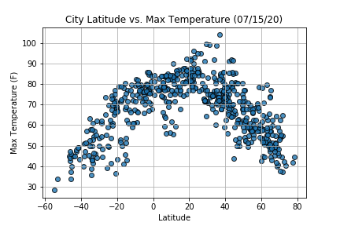
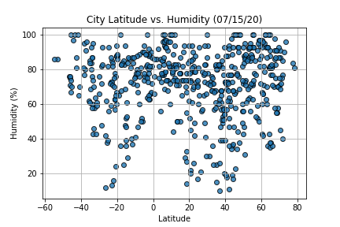
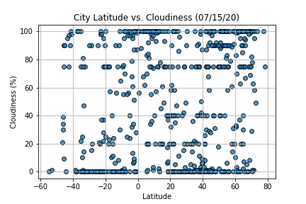
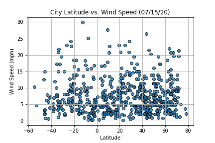
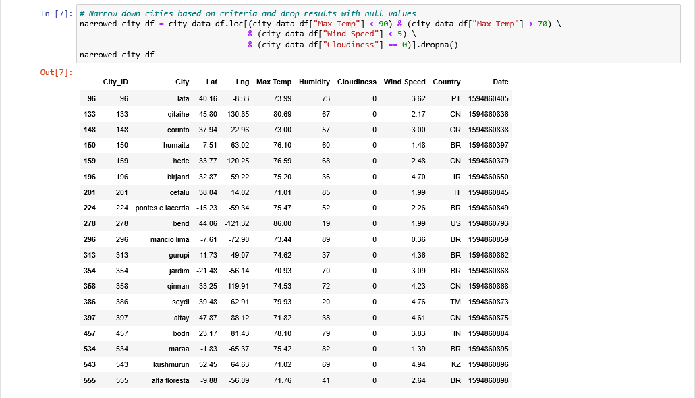

# python-api-challenge

### WeatherPy ###
*Overview,*
*WeatherPy: Running Code,*
*Figures,*
*Analysis Report,*
*Infographic*

### VacationPy ###
*Overview,*
*VacationPy: Running Code,*
*Maps*

*Techonlogies used*

## WeatherPy ##
### Overview ###
*WeatherPy*
In this example, you'll be creating a Python script to visualize the weather of 500+ cities across the world of varying distance from the equator. To accomplish this, you'll be utilizing a simple Python library, the OpenWeatherMap API, and a little common sense to create a representative model of weather across world cities.
Your first requirement is to create a series of scatter plots to showcase the following relationships:

* Temperature (F) vs. Latitude
* Humidity (%) vs. Latitude
* Cloudiness (%) vs. Latitude
* Wind Speed (mph) vs. Latitude

After each plot add a sentence or too explaining what the code is and analyzing.
Your second requirement is to run linear regression on each relationship, only this time separating them into Northern Hemisphere (greater than or equal to 0 degrees latitude) and Southern Hemisphere (less than 0 degrees latitude):

* Northern Hemisphere - Temperature (F) vs. Latitude
* Southern Hemisphere - Temperature (F) vs. Latitude
* Northern Hemisphere - Humidity (%) vs. Latitude
* Southern Hemisphere - Humidity (%) vs. Latitude
* Northern Hemisphere - Cloudiness (%) vs. Latitude
* Southern Hemisphere - Cloudiness (%) vs. Latitude
* Northern Hemisphere - Wind Speed (mph) vs. Latitude
* Southern Hemisphere - Wind Speed (mph) vs. Latitude

After each pair of plots explain what the linear regression is modeling such as any relationships you notice and any other analysis you may have.
Optional You will be creating multiple linear regression plots. To optimize your code, write a function that creates the linear regression plots.

### WeatherPy: Running Code ###

### Figures ###

### Analysis Report ###
##### TEMPERATURE AND LATITUDE #####
At this time of the year, the temperature has a "bell shape" and is almost symmetrical with the 0 Degree Latitude being the axis. The highest temperature are around the Equator. the tilt of the earth makes that the Southern Hemisphere is in winter and the Northern Hemisphere is in summer. If it was winter in the Northern Hemisphere, we could observe a negative regression with more data point grouped in the high temperature in the Southern Hemisphere and the opposite in the Northern Hemisphere.

##### CLOUDINESS AND LATITUDE #####
There is no strong relationship between Latitude and cloudiness. However, there is a concentration at the 60 degree Latitude and the Equator. Because, the air rises, the atmospheric pressure is low and the climate is wet, we have more clouds in these regions. On the scattered plot, we can observe a concentration of cities of a 100% cloudiness at the Equator and the 60 degree Latitude.

##### WIND SPEED AND LATITUDE #####
There is no strong relation between wind speed and Latitude. More data points are between 0mph and 10mph. However, we can observe that there are data concentration at the Equator, the 60 degree Latitude. This is explained by the jet streams who met at these latitude (60 degree Lat.: where Westlies stream and Polar Easteries meet / Equator: it is where the North/East and South/East trade winds meet). If we were in in the winter period we would observe more strong winds around the 30 and 40 degree Latitude and on the 60 degree Latitude.

### Infographic ###

## VacationPy ##
### Overview ###

Now let's use your skills in working with weather data to plan future vacations. Use jupyter-gmaps and the Google Places API for this part of the assignment.

* Create a heat map that displays the humidity for every city from the part I of the homework.
* Narrow down the DataFrame to find your ideal weather condition. For example:
* A max temperature lower than 80 degrees but higher than 70.
* Wind speed less than 10 mph.
* Zero cloudiness.
* Drop any rows that don't contain all three conditions. You want to be sure the weather is ideal.
* Using Google Places API to find the first hotel for each city located within 5000 meters of your coordinates.
* Plot the hotels on top of the humidity heatmap with each pin containing the Hotel Name, City, and Country.

### WeatherPy: Running Code ###

### MAPS ###

## Technologies used ##
* Pandas Library: DataFrame.plot()
* OneWeatherMap API
* Google Maps API
* Jupyter Notebook
* Adobe Illustrator
* .cvs files
  
## Authors ##
Sylvain David - Data Analytics Bootcamp - Vanderbilt University - 2020
Illustrations by Sylvain David - All Rights Reserved - 2020